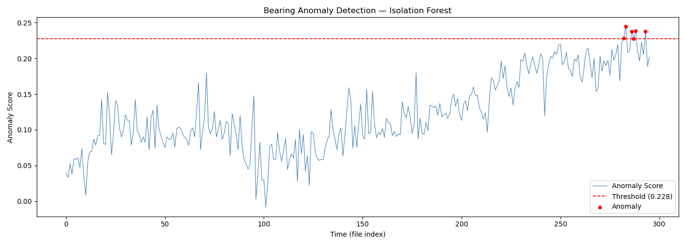

# bearing-fault-detection
Predictive maintenance using anomaly detection on NASA bearing dataset
# Bearing Fault Detection — Predictive Maintenance

## Problem
Rotating machinery fails without warning causing costly downtime.
This project detects faults early by analyzing vibration sensor data.

## Architecture
Raw Vibration → Feature Extraction → Isolation Forest → Anomaly Scores → Alert

## Dataset
NASA IMS Bearing Dataset — real vibration recordings from 4 bearings
running until failure at 20kHz sampling rate.

## Approach
- Extracted 20 statistical features per time window (RMS, Peak,
  Kurtosis, Skewness, Crest Factor) across 4 bearing channels
- Trained Isolation Forest on healthy baseline data (first 70%)
- Scored remaining data to detect anomalies before failure
- Exported model to ONNX format for edge deployment

## Results

- Detected bearing degradation before mechanical failure
- Model size under 50KB — deployable on Raspberry Pi / ESP32

## Edge Deployment
Model exported to ONNX format and stored on AWS S3.
Can run on embedded hardware without cloud connectivity.

## How to Run
pip install -r requirements.txt
python bearing_anomaly.py
